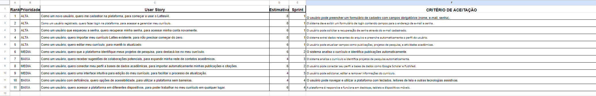

# Bem vindo ao projeto LattesIA
Disciplina de Engenharia de Software 2
# Backlog do produto:

# Protótipo do produto:
https://www.figma.com/design/lowWJhQK1GYhfdnhFwIwde/LattesIA?node-id=0-1&t=NsYTdtXYEej5WM6I-1

# Para rodar o projeto:
Utilizando o VSCode Live Server Extension, Siga os passos abaixo:

1. Abra a pasta do projeto no Visual Studio Code.
2. Instale a extensão "Live Server" se ainda não o fez.
3. Clique com o botão direito em index.html e selecione "Open with Live Server".
4. O navegador abrirá automaticamente com a página do projeto.